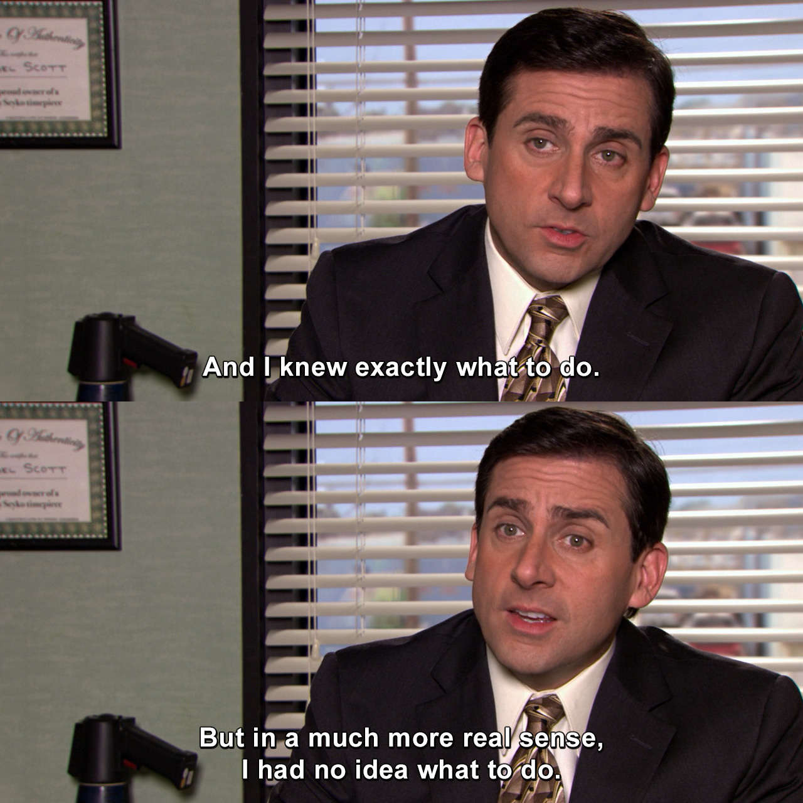

<!-- Inspired by: https://github.com/tusharnankani/tusharnankani-->

<h1 align="center">
I'm <a href="https://www.linkedin.com/in/rogelio-j-lopez/">Rogelio Lopez</a>. Welcome to my GitHub!
</h1>

<h3>
 🎓 Florida State University 
     - Computer Science 
  
</h3>
<h3>
 📄 <a href="./Rogelio_Lopez_Resume.pdf">Resume</a>
</h3>

### ⚡ &nbsp;Tech Stack

&nbsp;
&nbsp;
&nbsp;
&nbsp;
&nbsp;
&nbsp;

### 🧠 &nbsp;Learning
&nbsp;

<h3>
🤝🏻 Get in touch!
</h3>
  
|  | 
|:---:|:---:|
  
 
 
